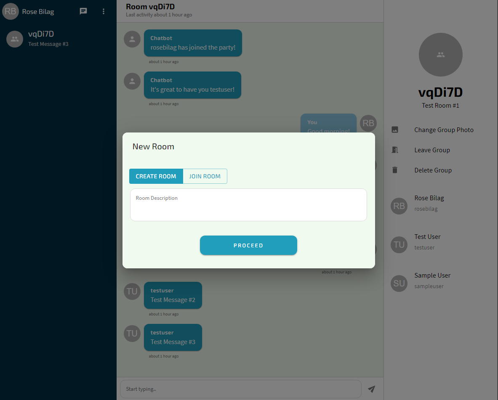
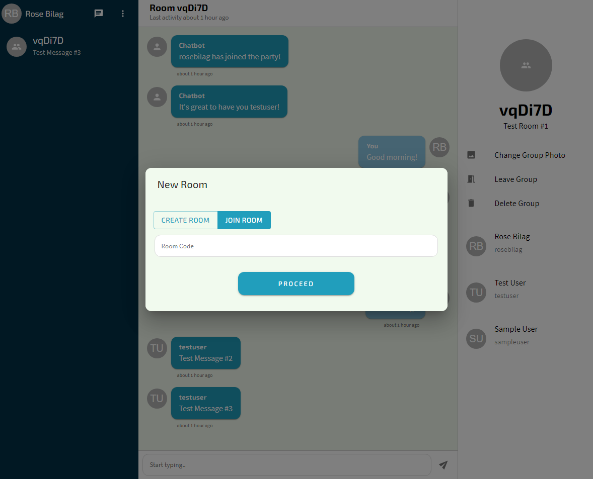

[![Netlify Status][netlify-shield]][netlify-url]
[![Issues][issues-shield]][issues-url]
[![LinkedIn][linkedin-shield]][linkedin-url]


<br />
<p align="center">
  <h1 align="center">Realtime Chat App</h1>
  
  <p align="center">
    A web-based messaging application that delivers messages instantaneously.
    <br /><br />
    <a href="https://rose-chat-client.netlify.app"><strong>View Demo »</strong></a>
    <br /><br />
    <a href="https://github.com/rosebilag/chat-frontend/issues">Report Bug</a>
    ·
    <a href="https://github.com/rosebilag/chat-frontend/issues">Request Feature</a>
  </p>
</p>


<details open="open">
  <summary><h2 style="display: inline-block">Table of Contents</h2></summary>
  <ol>
    <li>
      <a href="#about-the-project">About The Project</a>
      <ul>
        <li><a href="#built-with">Built With</a></li>
      </ul>
    </li>
    <li>
      <a href="#getting-started">Getting Started</a>
      <ul>
        <li><a href="#prerequisites">Prerequisites</a></li>
        <li><a href="#installation">Installation</a></li>
        <li><a href="#credentials">Credentials</a></li>
      </ul>
    </li>
    <li><a href="#usage">Usage</a></li>
    <li><a href="#contact">Contact</a></li>
  </ol>
</details>


## About The Project

### Built With
* **[React](https://reactjs.org/)**
* **[Socket.io](https://socket.io/)**
* **[Typescript](https://www.typescriptlang.org/)**
* [Node.js](https://nodejs.org/en/)
* [MongoDB](https://www.mongodb.com/)


## Getting Started
To get a local copy up and running follow these simple steps.


### Prerequisites
Install latest version of npm
* npm
  ```sh
  npm install npm@latest -g
  ```

### Installation
1. Clone the project
   ```sh
   git clone https://github.com/rosebilag/chat-frontend.git
   ```
2. Go to project directory and Install NPM packages
   ```sh
   npm install
   ```
3. Create .env file with the ff. content
   ```sh
   REACT_APP_SERVER_URL=https://rose-chat-backend.herokuapp.com
   ```
4. Start the application
   ```sh
   npm start
   ```


### Credentials
You can use any of the provided usernames. They all have the same password.

Usernames:
<ul>
    <li>rosebilag</li>
    <li>testuser</li>
    <li>sampleuser</li>
</ul>
Password: 123password


## Usage
**Creating a Room**

1. Click the message icon on the sidebar header.
2. Inputing the necessary fields.
3. Share the randomly-generated room code with people you want to invite in the room.

**Joining a Room**

1. Obtain the room code from the room creator.
2. Click the message icon on the sidebar header.
3. Click 'Join Room' tab option.
4. Input room code and proceed.


## Contact
Rose Bilag - [LinkedIn](https://linkedin.com/rosejoybilag) - hello@rosebilag.com

Project Link: [https://github.com/rosebilag/chat-frontend](https://github.com/rosebilag/chat-frontend)


[netlify-shield]: https://img.shields.io/netlify/24e36167-88a7-4e1e-93f5-0986aa1c1b7d?style=for-the-badge
[netlify-url]:https://app.netlify.com/sites/rose-chat-client/deploys
[issues-shield]: https://img.shields.io/github/issues/rosebilag/repo.svg?style=for-the-badge
[issues-url]: https://github.com/rosebilag/chat-frontend/issues
[linkedin-shield]: https://img.shields.io/badge/-LinkedIn-black.svg?style=for-the-badge&logo=linkedin&colorB=555
[linkedin-url]: https://linkedin.com/in/rosebilag